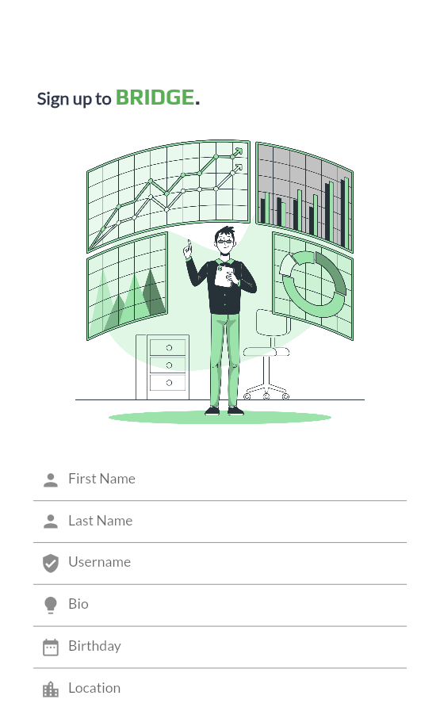
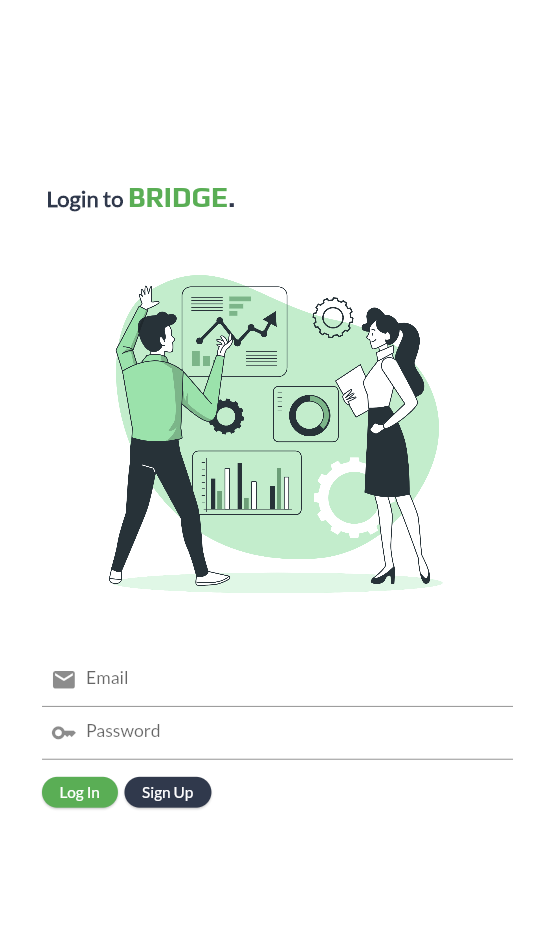
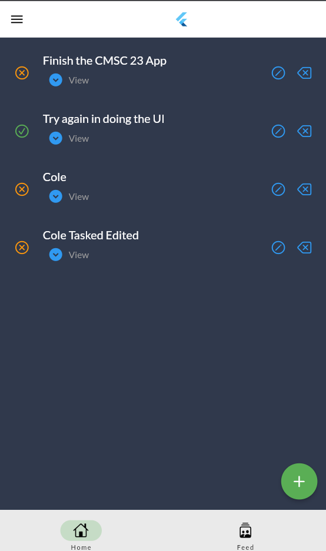
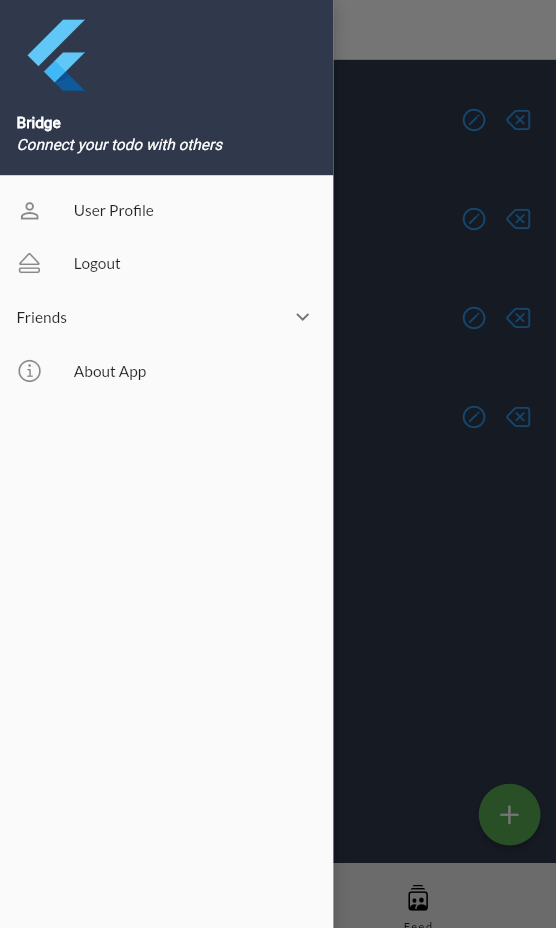

# Bridge: A Shared Todo Mobile App

## Description
Bridge is a Flutter mobile application composed of a sign in, sign-up and a shared todo list features with user's friends.

## Technologies Used

## Screenshots
#### Sign up Page

 

#### Login Page

 

#### Todo Page

 

#### Drawer

 

## License
This project is licensed under the [Creative Commons Attribution-NonCommercial-ShareAlike (CC BY-NC-SA) 4.0 International License](https://creativecommons.org/licenses/by-nc-sa/4.0/).

## Additional Notes
Bridge is an academic project developed as a part of CMSC 23 (Mobile Computing) in UPLB. 